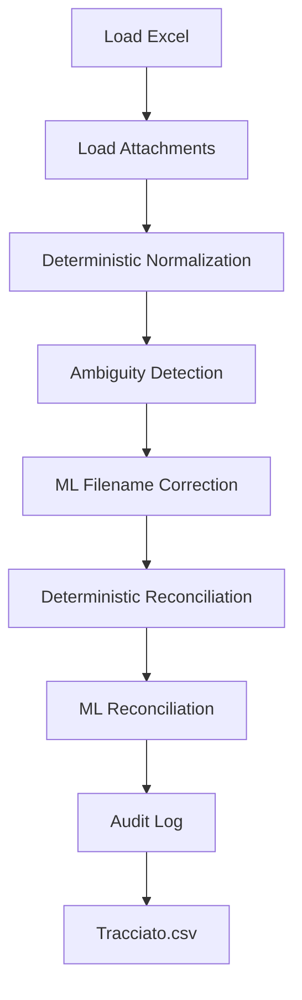

# pec-email-automation-pipeline
# Document Validation Pipeline

## Project Overview

This project recreates a document-processing workflow inspired by a real administrative environment where data accuracy was critical.

The current version includes the foundations of an automated validation pipeline and a synthetic data generator capable of producing both valid and intentionally corrupted records. Future versions will extend it with reconciliation, audit logging, and ML-assisted decision support.

The dataset intentionally includes realistic data-quality issues such as malformed filenames, invalid email addresses, spacing problems, extension errors, forbidden characters, and mismatches between database records and physical files.

---

## Project Status

This project is currently under active development.

### Current progress:

✔ Synthetic data generation
✔ Automated testing
✔ Validation pipeline foundation
    - Excel schema validation
    - Attachment loading
    - Deterministic filename normalization
    - Ambiguity detection

---

## Motivation

This project was inspired by a document-processing workflow I previously automated in an administrative role.

The original process involved validating sender email addresses, matching document references, checking attachment names, detecting formatting issues, and preparing data for import into a document management system.

Because sensitive information was involved, the workflow required very high accuracy. The Excel automation I created at the time reduced manual work and helped prevent errors during data preparation.

This Python implementation recreates that type of workflow using synthetic data and serves as the foundation for an automated validation and cleaning pipeline.

---

## Architecture

The project is intentionally divided into two independent components:

- **Synthetic data generator**, which creates realistic test datasets containing both valid and intentionally corrupted records.
- **Validation pipeline**, which processes the generated data through deterministic validation, machine-learning assisted correction, reconciliation, and audit logging.

This separation allows the generator to evolve independently from the validation logic while providing reproducible test scenarios.

---

## Business Rules Recreated

The project is based on several real-world validation rules:

- Sender email addresses should not contain leading or trailing spaces.
- Invalid email addresses should be detected.
- Codes or identifiers from document references should match attachment names.
- Multiple attachment names may need to be joined into the same Excel cell.
- Attachments must use the `.pdf` extension.
- Malformed extensions such as `..pdf` or `.pdf.pdf` should be detected and corrected.
- Forbidden filename characters should be detected.
- Filename issues are corrected automatically when a safe correction is possible; otherwise they are flagged for manual review.
- File paths copied from the attachment folder should match the records in the Excel file.
- Invalid email addresses are detected and reported, but are not automatically corrected because the correct recipient cannot be determined safely.

Important note: the correct document name is stored inside the generated attachment file content. This reflects the real workflow, where the agent was expected to copy the same document name into both the file name and the Excel database, but manual copying could introduce mistakes.

Email addresses inside documents may also be incorrect because they represent data extracted from a company database. In the real workflow, such errors would need to be corrected at the source.

---

## Audit Log

The future validation pipeline will generate an audit log categorizing issues as:

### Automatically Corrected

- Duplicate PDF extensions
- Invalid filename characters
- Extra whitespace
- File naming normalization

### Manual Review Required

- Invalid email addresses
- Missing attachments
- Document reference mismatches
- Ambiguous filename corrections
- Attachments listed in Excel but missing from disk
- Attachments found on disk but not listed in Excel
- Ambiguous document-reference mismatches

This approach mirrors real-world business workflows where data can only be modified automatically when the correction is considered safe and deterministic.

---

## Features

### Validation Pipeline

The validation pipeline consists of the following stages:



The audit log will document detected issues, automatic corrections, and records requiring manual review.

#### Current pipeline functionality includes:

Implemented:

    - Load Excel workbook
    - Excel schema validation
    - Load attachment filenames
    - Deterministic filename normalization
    - Filename ambiguity detection
    - Deterministic pipeline testing

In Progress:

    - ML-assisted filename correction

Planned:

    - ML-assisted filename correction
    - Deterministic filename reconciliation
    - ML-assisted reconciliation
    - Audit log
    - Email validation
    - Tracciato.csv generation

### Current synthetic data generation functionality includes:

- Synthetic company generation using Faker
- Italian VAT number generation
- PEC email generation
- Physical PDF attachment generation
- Excel export generation using Pandas
- Controlled data corruption for testing purposes
- Simulation of missing attachments
- Simulation of orphan-attachments
- Filesystem-safe filename generation
- Unit testing with pytest
- Integration testing of the complete generation workflow

#### Synthetic Error Simulation

The generator intentionally creates realistic inconsistencies commonly found in document-processing workflows.

Examples include:

- Invalid PEC email formats
- Malformed PDF extensions
- Illegal filename characters
- Leading and trailing spaces
- Filesystem-safe filename normalization
- Missing attachments referenced in Excel
- Orphan attachments present only on disk
- Filename discrepancies between Excel records and physical documents

These anomalies provide realistic input data for the future validation and machine-learning pipeline.

---

## Project Structure

```text
generate_mock_data.py
pipeline.py
tests/
    test_generate_mock_data.py
    test_pipeline.py
README.md
docs/
    pipeline_design.md
doc/
richiesta.xlsx
```

---

## Technologies Used

- Python
- Faker
- Pandas
- openpyxl
- pytest

---

## Environment

The project is currently developed and tested in a Conda environment.

Required packages:

- Faker
- pandas
- openpyxl
- pytest

Example installation using Conda:

```bash
conda install pandas openpyxl pytest
conda install -c conda-forge faker
```

Alternatively, the packages may be installed using pip.

---

## Testing

The project contains both unit tests and integration tests.

### Unit Tests

Unit tests validate individual business rules, including:

- Configuration generation
- Email normalization
- Company name generation
- File naming logic
- Corrupted extension generation
- Filename consistency checks
- Attachment file writing helper
- Orphan attachment file generation helper

### Integration Tests

Integration tests validate the complete workflow, including:

- Environment generation
- Attachment creation
- Excel export generation
- Output schema validation
- Required field validation
- Attachment reconciliation scenarios

---

## How to Run Tests

Run all tests with:

```bash
pytest
```

For more detailed output:

```bash
pytest -v
```

For coverage reporting:

```bash
pytest --cov=generate_mock_data --cov=pipeline --cov-report=term-missing```
---

## Quality Assurance

Current test suite:

- 44 automated tests
- Unit tests
- Integration tests
- Workflow tests
- 93% overall code coverage
- 95% coverage (generate_mock_data.py)
- 89% coverage (pipeline.py)

The test suite includes a deterministic integration test for orphan attachments, verifying that files can exist on disk without a corresponding Excel record.

A separate deterministic test for randomly generated missing attachments is not included yet because missing files are currently created using probabilistic generation. This scenario will be tested more precisely in the future validation pipeline, where missing attachment detection can be tested directly against controlled input data.

---

## ## Future Development

The current version focuses on synthetic data generation, automated testing, and the foundations of the validation pipeline.

Future development will focus on reconciliation, audit logging, and machine-learning assisted decision support.
---

## Lessons Learned

This project provided practical experience with:

- Python project structure
- Synthetic data generation
- File system operations
- Pandas workflows
- Automated testing with pytest
- Integration testing
- Debugging edge cases caused by random data generation
- Designing maintainable helper functions
- Separate business logic from file generation
- Designing modular data-validation pipelines

I also learned that designing the validation pipeline requires separating deterministic business rules from ambiguous cases suitable for ML-assisted decision making.

One of the most valuable findings was identifying a filesystem bug through integration testing, demonstrating how automated tests can uncover issues that are difficult to detect through manual testing alone.
